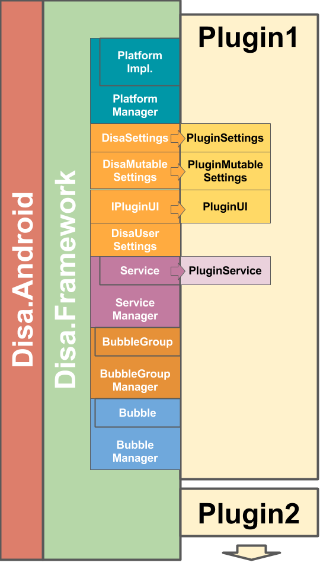

# 2 The Disa Framework
The Disa Framework provides a set of logical building blocks to provide developers everything they need to build plugins for their favorite instant messaging platforms (or anything that they can really _make_ out of it). The building blocks cover the following categories:

- A set of platform abstractions that allow you to interact with a particual platform (e.g., Android) in a platform agnostic manner.
  - PlatformManager, PlatformImplementation
- A categorized set of setting implementations for you to derive from to support your plugin's setting needs
    - DisaSettings, DisaMutableSettings, IPluginUI, DisaUserSettings
- A Service Manager and defined Service lifecycle to allow your plugin to register and expose its functionality in a Disa front-end (e.g., Disa.Android).
  - Service Manager, Service
- A conversation thread manager and a representation for a conversation thread
  - BubbleGroupManager, BubbleGroup
- A conversation element manager and representation for various conversation elements
  - BubbleManager, Bubble

The following diagram gives a high-level overview of the Disa.Framework components.

