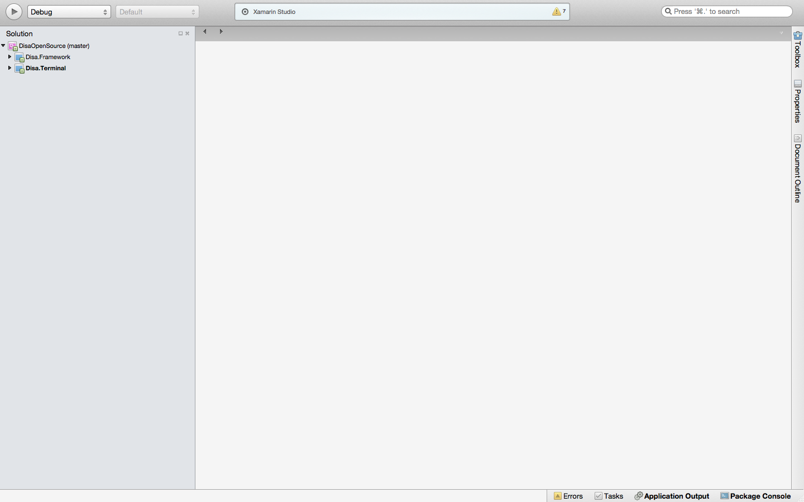

# The Most Basic Plugin

## Abstract

If you ventured into here by now, you're probably wanting to know how to start building a plugin.

This tutorial will guide you into building a very basic plugin for WackyMessenger (a made-up service). WackyMessenger is incredibly basic - it only supports text messages. When a user sends a text message, it waits a few seconds, and then responds to the user with his or her message reversed.

The source to this plugin can be found in full under the Examples/TheMostBasicPlugin folder in the main directory.

## Setting Up Your IDE

Alright, to begin! You need to setup your IDE. We'll be using Xamarin Studio (as I am on a Mac). However, Visual Studio works just fine too and you should be able to follow along easily. If not, send us an email at opensource@disa.im and we'll figure it out.

First, clone or download this repo. Then, open it. You should be presented with a screen similar to this:

Now, lets add our WackyMessenger project. Add a new Library project (not the PCL one!) by choosing .NET from "Other", then choosing "Library", and calling it Disa.Framework.WackyMessenger.

Aside: for plugins to properly work, they need to be labelled with the Disa.Framework prefix. If for example, I was writing a Telegram plugin, I'd label the plugin project Disa.Framework.Telegram.
There will now be three projects in your solution:

Go ahead, and add Disa.Framework as a reference to Disa.Framework.WackyMessenger. Then, add Disa.Framework.WackyMessenger as a reference to Disa.Terminal. You'll now be left with the following:

Wonderful! Now we're ready to add the service skeleton.

Add the Service Skeleton

Create a new file in Disa.Framework.WackyMessenger, calling it WackyMessenger.cs.

Paste the following into the file:

    using System;
    using System.Threading.Tasks;
    using System.Collections.Generic;
    using Disa.Framework.Bubbles;

    namespace Disa.Framework.WackyMessenger
    {
        [ServiceInfo("WackyMessenger", true, false, false, false, false, typeof(WackyMessengerSettings), 
            ServiceInfo.ProcedureType.ConnectAuthenticate, typeof(TextBubble))]
        public class WackyMessenger : Service
        {
            public override bool Initialize(DisaSettings settings)
            {
                throw new NotImplementedException();
            }

            public override bool InitializeDefault()
            {
                throw new NotImplementedException();
            }

            public override bool Authenticate(WakeLock wakeLock)
            {
                throw new NotImplementedException();
            }

            public override void Deauthenticate()
            {
                throw new NotImplementedException();
            }

            public override void Connect(WakeLock wakeLock)
            {
                throw new NotImplementedException();
            }

            public override void Disconnect()
            {
                throw new NotImplementedException();
            }

            public override string GetIcon(bool large)
            {
                throw new NotImplementedException();
            }

            public override IEnumerable<Bubble> ProcessBubbles()
            {
                throw new NotImplementedException();
            }

            public override void SendBubble(Bubble b)
            {
                throw new NotImplementedException();
            }

            public override bool BubbleGroupComparer(string first, string second)
            {
                throw new NotImplementedException();
            }

            public override Task GetBubbleGroupLegibleId(BubbleGroup group, Action<string> result)
            {
                throw new NotImplementedException();
            }

            public override Task GetBubbleGroupName(BubbleGroup group, Action<string> result)
            {
                throw new NotImplementedException();
            }

            public override Task GetBubbleGroupPhoto(BubbleGroup group, Action<DisaThumbnail> result)
            {
                throw new NotImplementedException();
            }

            public override Task GetBubbleGroupPartyParticipants(BubbleGroup group, Action<DisaParticipant[]> result)
            {
                throw new NotImplementedException();
            }

            public override Task GetBubbleGroupUnknownPartyParticipant(BubbleGroup group, string unknownPartyParticipant, Action<DisaParticipant> result)
            {
                throw new NotImplementedException();
            }

            public override Task GetBubbleGroupPartyParticipantPhoto(DisaParticipant participant, Action<DisaThumbnail> result)
            {
                throw new NotImplementedException();
            }

            public override Task GetBubbleGroupLastOnline(BubbleGroup group, Action<long> result)
            {
                throw new NotImplementedException();
            }
        }

        public class WackyMessengerSettings : DisaSettings
        {
            // store settings in here:
            // e.g: public string Username { get; set; }
        }
    }

At the very top of the Service class, we specify its information (i.e: how the framework must manage it).

    [ServiceInfo("WackyMessenger", true, false, false, false, false, typeof(WackyMessengerSettings), ServiceInfo.ProcedureType.ConnectAuthenticate, typeof(TextBubble))]

We will be using event driven bubbles. What does this mean? Some services require a dedicated thread to be infinitely polling against a keep-alive connection. By setting event driven bubbles to false, the ProcessBubbles iterator block is called in an infinite threaded loop while the service is running. Thus, the Framework completely manages this aspect of keeping the poller constantly alive. By setting event driven bubbles to true, you are effectively telling the Framework: "I want to manage all the polling myself, and invoke off the EventBubble method whenever I a new bubble comes in."

We will not be using media progress. We don't support anything but text bubbles. If your service can support giving feedback back to the client on the upload process of media bubbles (images, videos, etc), you'll set this flag to true and then use the Transfer.Progress callback in the associated media bubble you're uploading.

This service does not use internet. If it we set this to true, then the Framework will ensure that the service is stopped if there is no internet connection.

This service does not support battery savings mode.

This service does not use delayed notifications. Delayed notifications will delay notification dispatches by 1 (one) second. Setting this to true and using NotificationManager.Remove allows you to have multiple clients working together without notifications going off while chatting on another client.

The Framework manages a settings store of your service. You can use this to store any information. WackyMessenger doesn't need to store anything, so we don't need it. Additionally, you can use MutableSettings and MutableSettingsManager to save information you find yourself frequently saving (such as a timestamp you need to keep updated everytime the service is started).

The procedure type is set to ConnectAuthenticate. This means that the service scheduler will call Connect before calling Authenticate. The other option is AuthenticateConnect - which called Authenticate before Connect. Once again, the option is given here because some services require Authenticating before connecting, and vice-versa.

Finally, the last argument is a params[] of all the supported bubble types. Since WackyMessenger only supports Text bubbles, that's the only bubble we list there.

It also should be mentioned that if you use files, audio, or video bubbles in your plugin, you need to add the associated attribute. These can be found in ServiceInfo.cs.

Great! Now let's talk a bit about the starting of your newly implemented service.

## Service Start Process

The first thing that happens is that InitializeDefault() is called. It attempts to try and start the service without any settings. If this method returns true, it is assumed your service doesn't need any settings. Authenticate and Connect is then directly called afterwards (the order of which one is first depends on your set procedure type, as mentioned above). If this method returns false, then InitializeDefault(DisaSettings) is called - the framework provided you with your stored settings. Whenever you want to save your settings, you can call SettingsManager.Save.

So, for WackyMessenger, all we need to do is initialize the default - we are not using Settings.

    public override bool InitializeDefault()
    {
         return true;
    }

For connect, WackyMessenger doesn't really connect to anything. So, we can just leave it blank:

    public override void Connect(WakeLock wakeLock)
    {
       // do nothing
    }

As with Authenticate:

    public override bool Authenticate(WakeLock wakeLock)
    {
       return true;
    }

What exactly is that WakeLock? Whenever Disa executes one of these methods, it holds a wake lock on the method's duration so the phone doesn't fall asleep and stop your service's starting process. However, wake locks are expensive to battery life. If you know that you can temporarily free the wakelock (such as when you're awaiting for a response from a server), you can use WakeLock.TemporaryFree disposable (wrap it in a using statement) to do so.

Aside: Whenever you are awaiting data from a socket connection (including HTTP connections) in Android, you can allow the device to fall asleep. When there's a response from the socket, your device will be woken back up, allowing the newly presented data to be processed. This is the motivation behind the temporary free optimization.
In the event that Authenticate or Connect doesn't succeed, and can just pass up the exception to the Framework. It will deal with a connection failure or authentication failure accordingly. However, there are some exceptions to let the Framework know that there is something particularly wrong. For example, passing a ServiceExpiredException in one of these methods will let the Framework know that the service has expired (subscription needs to be repaid for example). For more exceptions, take a look at all the defined *Exceptions in the framework, and their mappings into the service scheduler.

## Service Stop Process

When a service is stopped, two methods are called: Deauthenticate and Disconnect. The order once again depends on the procedure type. Use these methods to teardown your service.

In WackyMessenger, we can simply ignore them, as there's nothing to teardown:

    public override void Deauthenticate()
    {
        // do nothing
    }

    public override void Disconnect()
    {
        // do nothing
    }

## Interim Summary

Your code should now look like this:

    .
    .
    .
    public override bool InitializeDefault()
    {
        return true;
    }

    public override bool Authenticate(WakeLock wakeLock)
    {
        return true;
    }

    public override void Deauthenticate()
    {
        // do nothing
    }

    public override void Connect(WakeLock wakeLock)
    {
        // do nothing
    }

    public override void Disconnect()
    {
        // do nothing
    }
    .
    .
    .

## Implementing bubble sending

Great. So now, the service will both start and stop. Its pretty damn useless though. Lets add some sending:
    
    public override void SendBubble(Bubble b)
    {
        var textBubble = b as TextBubble;
        if (textBubble != null) 
        {
         Utils.Delay(2000).Wait();
         Platform.ScheduleAction(1, new WakeLockBalancer.ActionObject(() = > 
            {
                EventBubble(new TextBubble(Time.GetNowUnixTimestamp(), Bubble.BubbleDirection.Incoming,
            textBubble.Address, null, false, this, Reverse(textBubble.Message)));
            }, WakeLockBalancer.ActionObject.ExecuteType.TaskWithWakeLock));
        }
    }

    private static string Reverse(string s)
    {
        char[] charArray = s.ToCharArray();
        Array.Reverse(charArray);
        return new string(charArray);
    }

Alright. So what's happening here? We wait 2 seconds (a poor simulation of how long it takes to send a message to a server), and then we schedule a wake-locked action to occur in 1 second. That action is an incoming message of the message we sent, reversed - exactly as we set out to do. The latter is accomplished by the `EventBubble` method call to which we got access to via the aforementioned `eventDrivenBubbles` flag.

After that, the `SendBubble` method ends - no exception has been encountered. That means that the Framework will mark the message successfully as sent. Fantastic! If any any exception is thrown up the stack in `SendBubble` (that is, to the Framework) then the Framework will mark the bubble as failed and alert the user via a notification if necessary. Moreover, if you catch that exception in the `SendBubble` method, and consequently throw a `ServiceQueuedBubbleException` back up the stack to the Framework, then you'll ask the Framework to resend to bubble. The Framework will then deal with sending the bubble a later time.

In addition to scheduling a once-off action, we can ask the Framework to schedule a reoccurring action (perfect for keep-alive heartbeats).

## ProcessBubbles

Even though WackyMessenger does not use the `ProcessBubbles` method, its important to explain a bit about it. Firstly, it's an iterator block. In a trivial messenger setup, you'll call upon your `Socket.Receive` blocking method in `ProcessBubbles`. When data comes in, it'll be processed by your serializer (XML, JSON, custom, etc.), and then objectified into a Disa Framework bubble. A mere `yield return bubble` will then catapult the bubble back to the Framework, in the exact same way that EventBubble behaves.

## Interim Summary 2

Alright, now you'll be left with something like this:

    .
    .
    .
    private static string Reverse( string s )
    {
        char[] charArray = s.ToCharArray();
        Array.Reverse( charArray );
        return new string( charArray );
    }

    public override void SendBubble(Bubble b)
    {
        var textBubble = b as TextBubble;
        if (textBubble != null)
        {
            Utils.Delay(2000).Wait();
            Platform.ScheduleAction(1, new WakeLockBalancer.ActionObject(() =>
            {
                EventBubble(new TextBubble(Time.GetNowUnixTimestamp(), Bubble.BubbleDirection.Incoming,
                    textBubble.Address, null, false, this, Reverse(textBubble.Message)));
            }, WakeLockBalancer.ActionObject.ExecuteType.TaskWithWakeLock));
        }
    }
    .
    .
    .

## The Final Tid-bits

We'll need to implement the `BubbleGroupComparer` method. This method is basically how Disa deals with grouping Bubbles into `BubbleGroups`. A BubbleGroup is synonymous with a thread or conversation.

In most cases, you'll just do an ordinal string comparison (the '==' in C#). However, in some cases you may need to use an algorithm - such as a `PhoneNumberComparer` that will yield equality to the number tuple +1 604 393 2838 and 604-393-2838. You can find this comparer in PhoneBook.cs.

In WackyMessenger's case, ordinal string comparison will suffice:

    public override bool BubbleGroupComparer(string first, string second)
    {
        return first == second;
    }

Next off, `GetBubbleGroupLegibleId`. Some conversations need an additional mark on them in the conversation list (in a SMS/MMS plugin, we need to label the conversation in the conversation list with a Mobile, Work, Home, tag).

In WackyMessenger, we don't need such a thing! Leave this method be - we don't need to touch it.

Next up, GetBubbleGroupName. This should be pretty self explanatory. How do I relate the address "604 232 9830" to "Meghan"? This is that method.

In WackyMessenger's case, its so simple, that we don't really have any way to relate an address back to who it is. After all, it is just repeating what we say. Therefore, the name of the BubbleGroup will be the address of it. Simple, right?

    public override Task GetBubbleGroupName(BubbleGroup group, Action<string> result)
    {
        return Task.Factory.StartNew(() =>
        {
            result(group.Address);
        });
    }

It should be noted that this is a common pattern that you'll be seeing in a lot of Disa's interface code. We try to enforce the plugin developer to use the Task Programming Library as tasks are cheap, and the Framework is incredibly asynchronous. When the result is found, you call the provided callback, result, with the, well, result.

Next, `GetBubbleGroupPhoto`. This gets the photo of the conversation. Once again, WackyMessenger is simple and dumb. Lets just tell the framework to generate the default thumbnail.

    public override Task GetBubbleGroupPhoto(BubbleGroup group, Action<DisaThumbnail> result)
    {
        return Task.Factory.StartNew(() =>
        {
            result(null);
        });
    }

The next three methods, `GetBubbleGroupPartyParticipants`, `GetBubbleGroupUnknownPartyParticipant`, `GetBubbleGroupPartyParticipantPhoto` are all Party orientated. WackyMessenger doesn't support parties yet. We'll ignore these for now - we'll come back to it in the later tutorials when we actually give WackyMessenger Party support.

And finally, `GetBubbleGroupLastOnline`, fetches the last seen time of the specified conversation. The BubbleGroup passed into here will always be a solo (i.e: not a Party/GroupChat). WackyMessenger doesn't support last seen times. Therefore, we just ignore it.

## Interim Summary 3

At this point, you should have the following code:

    using System;
    using System.Threading.Tasks;
    using System.Collections.Generic;
    using Disa.Framework.Bubbles;

    namespace Disa.Framework.WackyMessenger
    {
        [ServiceInfo("WackyMessenger", true, false, false, false, false, typeof(WackyMessengerSettings), 
            ServiceInfo.ProcedureType.ConnectAuthenticate, typeof(TextBubble))]
        public class WackyMessenger : Service
        {
            public override bool Initialize(DisaSettings settings)
            {
                throw new NotImplementedException();
            }

            public override bool InitializeDefault()
            {
                return true;
            }

            public override bool Authenticate(WakeLock wakeLock)
            {
                return true;
            }

            public override void Deauthenticate()
            {
                // do nothing
            }

            public override void Connect(WakeLock wakeLock)
            {
                // do nothing
            }

            public override void Disconnect()
            {
                // do nothing
            }

            public override string GetIcon(bool large)
            {
                throw new NotImplementedException();
            }

            public override IEnumerable<Bubble> ProcessBubbles()
            {
                throw new NotImplementedException();
            }

            private static string Reverse( string s )
            {
                char[] charArray = s.ToCharArray();
                Array.Reverse( charArray );
                return new string( charArray );
            }

            public override void SendBubble(Bubble b)
            {
                var textBubble = b as TextBubble;
                if (textBubble != null)
                {
                    Utils.Delay(2000).Wait();
                    Platform.ScheduleAction(1, new WakeLockBalancer.ActionObject(() =>
                    {
                        EventBubble(new TextBubble(Time.GetNowUnixTimestamp(), Bubble.BubbleDirection.Incoming,
                            textBubble.Address, null, false, this, Reverse(textBubble.Message)));
                    }, WakeLockBalancer.ActionObject.ExecuteType.TaskWithWakeLock));
                }
            }

            public override bool BubbleGroupComparer(string first, string second)
            {
                return first == second;
            }

            public override Task GetBubbleGroupLegibleId(BubbleGroup group, Action<string> result)
            {
                throw new NotImplementedException();
            }

            public override Task GetBubbleGroupName(BubbleGroup group, Action<string> result)
            {
                return Task.Factory.StartNew(() =>
                {
                    result(group.Address);
                });
            }

            public override Task GetBubbleGroupPhoto(BubbleGroup group, Action<DisaThumbnail> result)
            {
                return Task.Factory.StartNew(() =>
                {
                    result(null);
                });
            }

            public override Task GetBubbleGroupPartyParticipants(BubbleGroup group, Action<DisaParticipant[]> result)
            {
                throw new NotImplementedException();
            }

            public override Task GetBubbleGroupUnknownPartyParticipant(BubbleGroup group, string unknownPartyParticipant, Action<DisaParticipant> result)
            {
                throw new NotImplementedException();
            }

            public override Task GetBubbleGroupPartyParticipantPhoto(DisaParticipant participant, Action<DisaThumbnail> result)
            {
                throw new NotImplementedException();
            }

            public override Task GetBubbleGroupLastOnline(BubbleGroup group, Action<long> result)
            {
                throw new NotImplementedException();
            }
        }

        public class WackyMessengerSettings : DisaSettings
        {
            // store settings in here:
            // e.g: public string Username { get; set; }
        }
    }

Wonderful! We actually now have enough code to run out first plugin! ^^ exciting ^^

Let's Run It!

Add Disa.Framework.WackyMessenger as a reference in Disa.Terminal.

Go into Program.cs in Disa.Terminal, and change:

    Initialize(new Service[] { });

into

    Initialize(new [] { new WackyMessenger() });

Note: you may have to add a using statement to the top of Program.cs here.

    using Disa.Framework.WackyMessenger;

Now, launch Disa.Terminal.

You have to register a service before you can use it. So, Type:

    register WackyMessenger

You'll only have to do this once. Disa has now saved this setting onto your disk. Then type,

    startall

All the services will now start. We can now test our plugin:

    send WackyMessenger Meghan "Hello there"

Now, wait a bit.. and then you should get a response!

Wahoo, we did it!

## A Big Problem | Duplicate Bubbles

It's possible that Disa may send a bubbles twice (e.g: lost acknowledgment but server actually received the message which results in Disa resending the bubble again) - which is quite common when you have flaky internet connections. This isn't a flaw accustomed to just Disa - many other clients have the exact same issue.

To address this issue, bubbles typically get unique IDs associated with them. The bubble is then sent to the server along with an ID. If the server gets a duplicate ID, then it merely discards of it.

To implement this in Disa, implement the `IVisualBubbleServiceId` interface:

    public void AddVisualBubbleIdServices(VisualBubble bubble)
    {
        throw new NotImplementedException();
    }
    
    public bool DisctinctIncomingVisualBubbleIdServices()
    {
        throw new NotImplementedException();
    }

You are free to set the `VisualBubble.IdService` and `VisualBubble.IdService2` properties in `AddVisualBubbleIdServices`. `AddVisualBubbleIdServices` is called just before the bubble reached SendBubble in your service code.

`DisctinctIncomingVisualBubbleIdServices` asks if you want to filter any duplicate incoming bubbles. There's also the possibility that the server may send you multiple messages of the same ID. If this method returns true, it will filter those. If it returns false, it will not filter them.

In WackyMessenger's case, it's not necessary to include this. But for the sake of an example, here's the full-code with it implemented:

    using System;
    using System.Threading.Tasks;
    using System.Collections.Generic;
    using Disa.Framework.Bubbles;

    namespace Disa.Framework.WackyMessenger
    {
        [ServiceInfo("WackyMessenger", true, false, false, false, false, typeof(WackyMessengerSettings), 
            ServiceInfo.ProcedureType.ConnectAuthenticate, typeof(TextBubble))]
        public class WackyMessenger : Service, IVisualBubbleServiceId
        {
            private string _deviceId;
            private int _bubbleSendCount;
            .
            .
            .
            public void AddVisualBubbleIdServices(VisualBubble bubble)
            {
                bubble.IdService = _deviceId + ++_bubbleSendCount;
            }

            public bool DisctinctIncomingVisualBubbleIdServices()
            {
                return true;
            }
            .
            .
            .

Notice that we get the Unix timestamp here, and then append a message counter to it. This ensures that Message Ids are always unique.

## In Summary

In summary you have learned how to make your first plugin, and also quite a bit about the Disa Framework.

